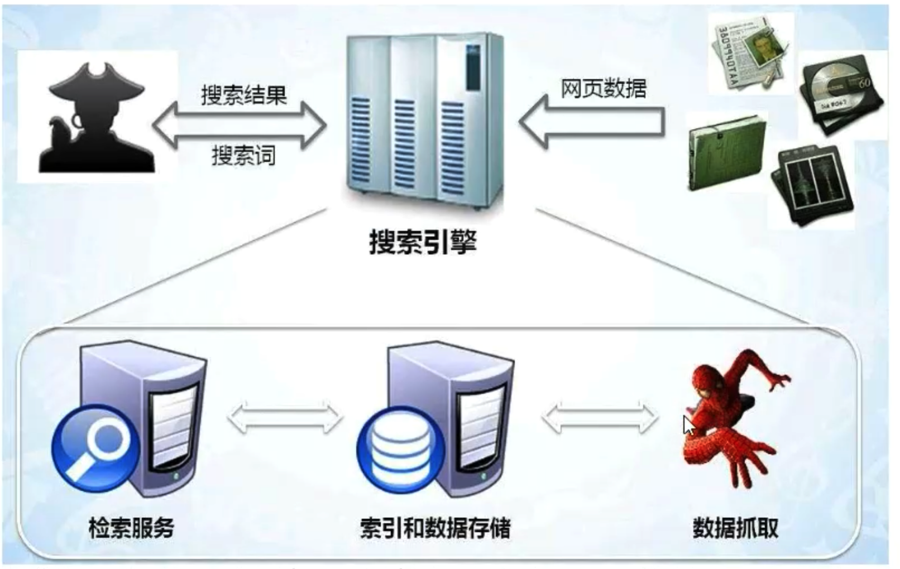

# nodejs网络爬虫技术

[toc]

## 什么是爬虫

可以把互联网比做成一张“大网”，爬虫就是在这张大网上不断爬取信息的程序。即，爬虫是请求网站并提取数据的自动化程序。

爬虫的基本工作流程如下：

1. 向指定的url 发送http请求
2. 获取响应(html, xml, json, 二进制等数据)
3. 处理数据(解析dom, 解析json等)
4. 将处理好的数据进行存储

## 爬虫的意义

爬虫就是一个探测程序，它的基本功能就是模拟人的行为去各个网站转悠，点点按钮，找找数据，或者把看到的信息背回来，就像一只虫子在一幢楼里不知疲倦地爬来爬去。

你可以简单地想象：**每个爬虫都是你的“分身”。就像孙悟空拔了一撮汗毛，吹出一堆🐒一样。**

你每天使用的google，其实就是利用了这种爬虫技术：每天放出无数爬虫到各个网站，把它们的信息抓回来，存到数据中等你来检索。

抢票软件， 就相当于撒出去无数个分身，每一个分身帮你不断刷新火车余票。一旦发现有票，就马上下单，然后对你喊：大爷快来付款呀。

在现实中，几乎所有行业的网站都会被爬虫所“骚扰”，而这些骚扰都是为了方便用户。

当时，有些网站是不能被过分骚扰的，其中排第一的就是出行类行业。

正所谓道高一尺魔高一丈，某些爬虫工具为了解决变态验证码，甚至推出了“打码平台”。原理就是爬虫还是不断工作，但只要遇到验证码，就通过打码平台下发任务，打码平台另一边就雇佣一大堆网络闲人，只要看到有验证码来了，就人工选一下验证码，完美的让程序与人工结合。

## 课程内容及目标

+ 爬虫简介
+ 制作一个自动下载图片的小爬虫
+ 使用Selenium爬取动态网站

## 前置知识

+ js基础
+ node基础